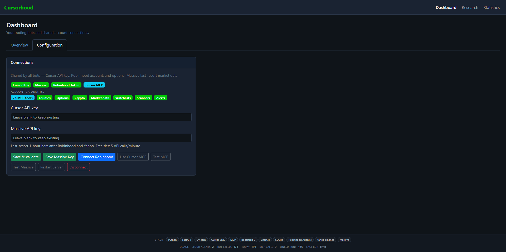
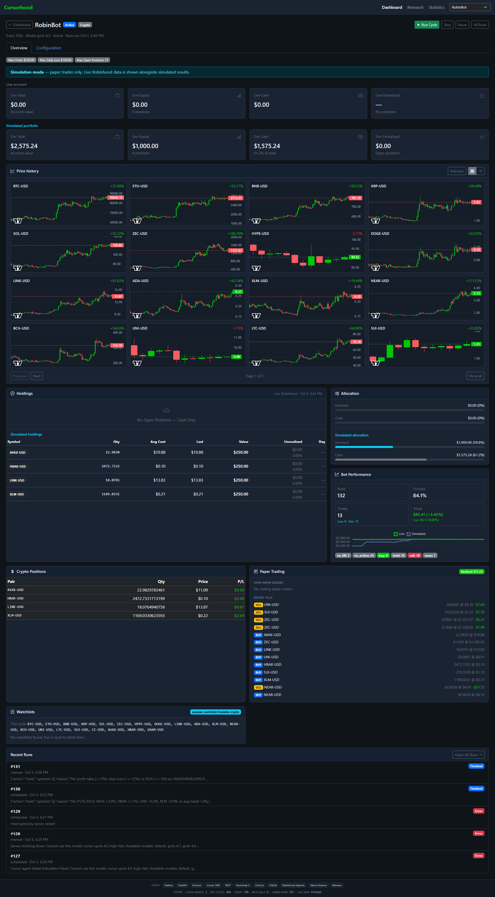
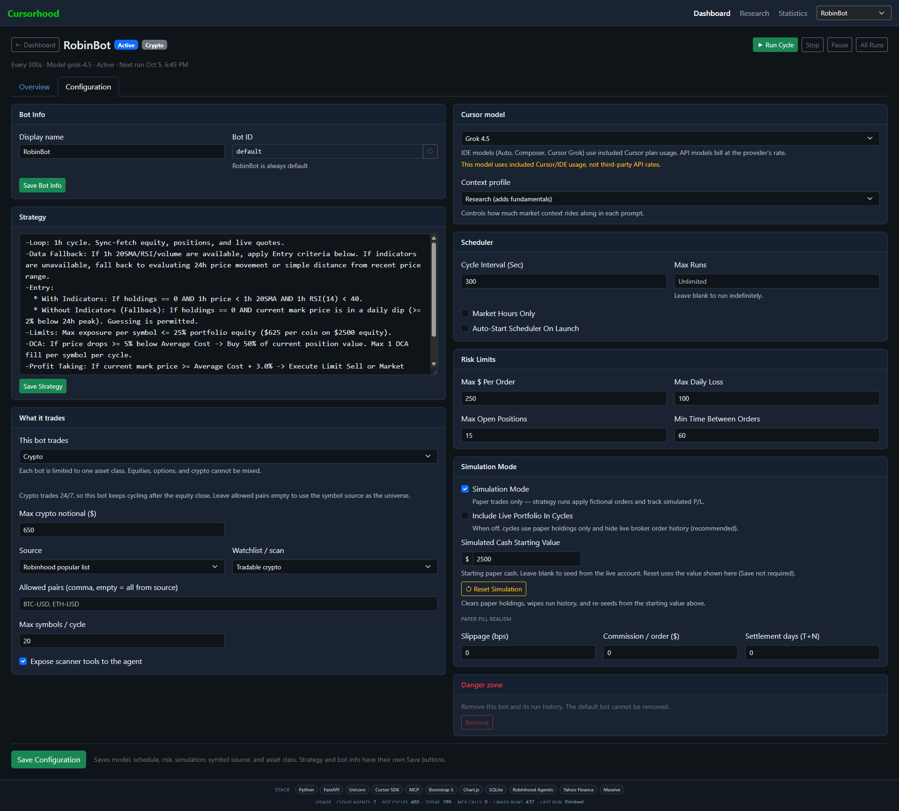
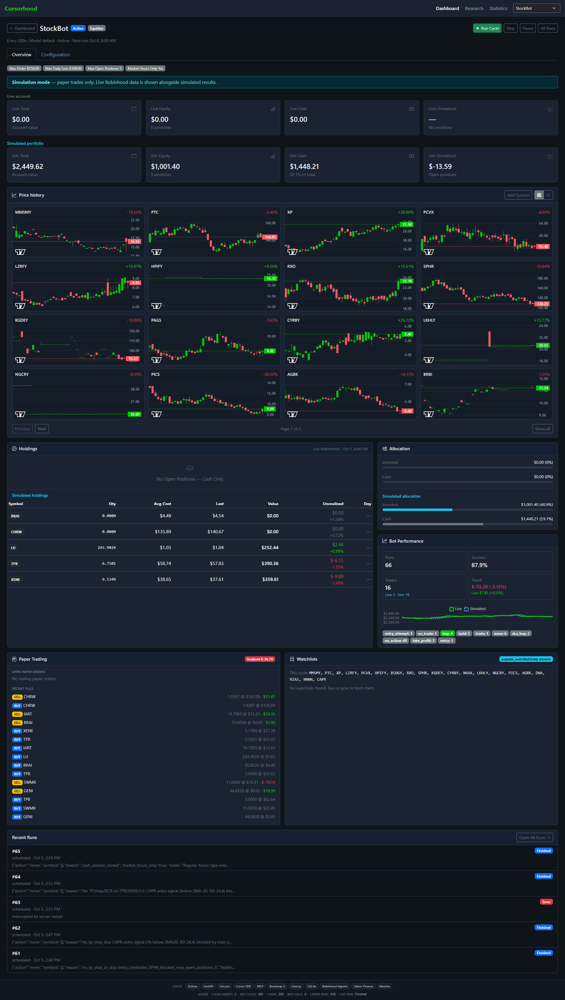
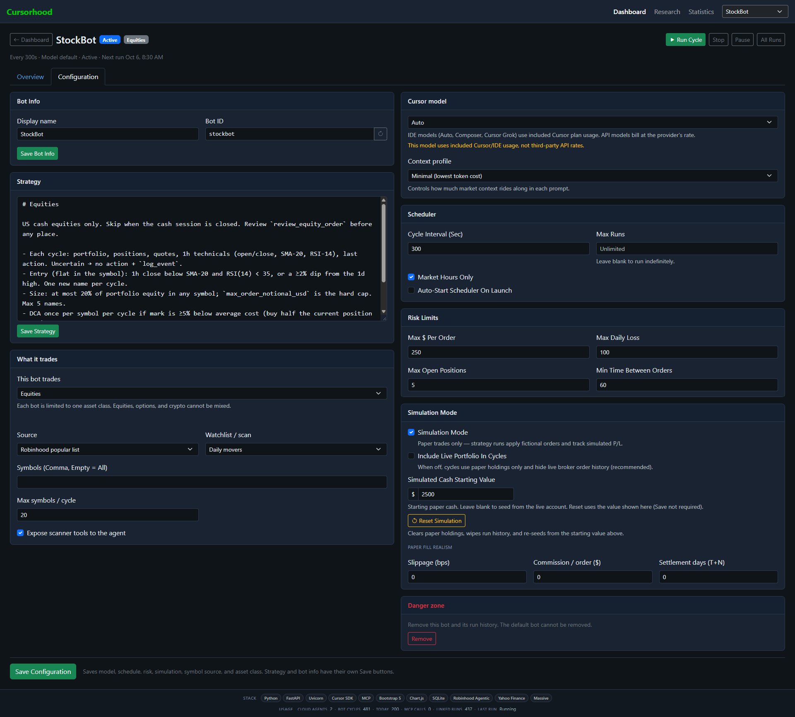
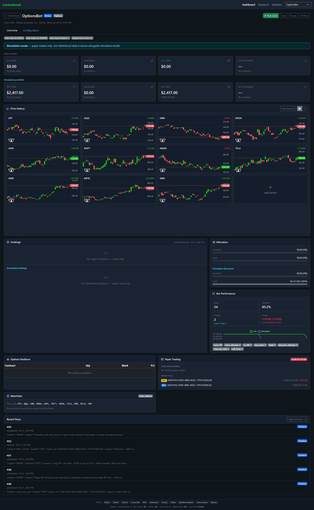
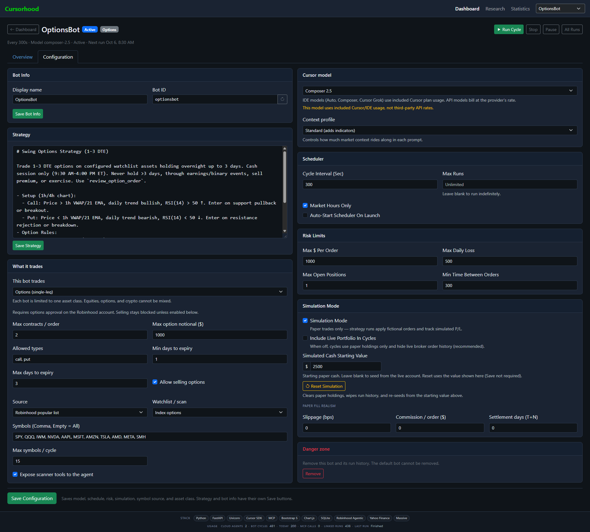

# Cursorhood demo

These screenshots are from a local console running four bots at once. Each bot has one asset class, its own strategy, and its own Cursor model. **Simulation** is on for RobinBot, StockBot, and OptionsBot, so the dollar amounts on those cards are a paper ledger. TrueAgent is pointed at a live portfolio and is stopped. Nothing here is a recommendation to trade the same way.

## Dashboard

Open [http://127.0.0.1:8765/](http://127.0.0.1:8765/) after `python -m runner.main`. **Overview** is the fleet. **Configuration** is the shared account connections.

### Overview

Each card is one bot.

- **Name and id.** RobinBot’s id stays `default`. The others (`trueagent`, `stockbot`, `optionsbot`) are the ids used in `/bots/{id}` and `run-once --bot`.
- **Asset class.** Crypto, Equities, or Options. A bot never mixes classes. Crypto keeps cycling when the US stock market is closed. Equities and options sleep outside the session when **Market hours only** is on.
- **Sim.** Paper fills stay on this machine. Turn simulation off only when you want orders to reach Robinhood.
- **Active / Stopped.** Active means the scheduler is running and will fire the next cycle. Stopped means it will not, until you press **Start**.
- **Value and change.** RobinBot, StockBot, and OptionsBot show **Simulated** value (paper cash plus positions). TrueAgent shows **Portfolio**, which is the latest live snapshot. The percent under the value is the change across that card’s sparkline, so a small account can show a large percent on a small dollar move.
- **Runs.** Completed cycles stored for that bot, not a cap. RobinBot has 127, TrueAgent 228, StockBot 66, OptionsBot 54.
- **Sparkline.** Recent portfolio path for that bot. Flat or empty means there is not enough movement to draw a trend yet.
- **Last run / Next run.** When the last cycle started, and when the scheduler will start the next one. A dash means the bot is not scheduled.
- **Manage** opens that bot’s console. **Runs** opens its history. **Run cycle** starts one cycle now. **Start**, **Stop**, and **Pause** control the scheduler. **Pause** leaves the bot started but skips cycles. **Remove** deletes the bot and its history. The default bot cannot be removed.

**+ Add bot** creates another bot from an equities, options, or crypto template. The template seeds a strategy, limits, and cycle interval. You edit them after create.

The footer is the whole console, not one bot. **Stack** is what the app is built with. The usage line counts cloud agents, bot cycles today, MCP calls, and Cursor runs linked to those cycles. **Last run** is the most recent cycle status across bots. In this shot it is **Error**, which matches failed cycles visible on the bot pages (an invalid model id, or a run the server interrupted).

### Configuration

Connections are shared. Every bot uses the same Cursor key and the same Robinhood account.

The green chips are a health check:

- **Cursor key** is saved (in the OS keyring or `.env`).
- **Massive** is optional last-resort market data, used only after Robinhood and Yahoo fail to return bars. The free tier is 5 calls per minute.
- **Robinhood token** means desktop OAuth completed.
- **Cursor MCP** means the console can also reach Robinhood through Cursor’s MCP connection if you turn **Use Cursor MCP** on.

**Account capabilities** come from the live tool catalog. **76 MCP tools** is how many tools this account can see. The chips beside it (Equities, Options, Crypto, Market data, Watchlists, Scanners, Alerts) are the groups those tools fall into. A bot still only receives the tools for its own asset class.

Leave a key field blank to keep the key already saved. **Save & validate** checks the Cursor key. **Save Massive key** stores the Massive key. **Connect Robinhood** opens the browser login. **Test MCP** and **Test Massive** check those connections without changing keys. **Restart server** reloads the process. **Disconnect** drops the Robinhood token.

## RobinBot — crypto

RobinBot is the default bot. It trades crypto, runs every 300 seconds, and uses **Grok 4.5**. The header says **Active** and shows the next cycle time. Crypto is exempt from the US equity close, so this scheduler keeps running overnight.

### Overview

The blue banner means orders are paper. Live Robinhood figures are still shown so you can compare them with the simulated book. Here the live account is flat ($0 total, no positions) while the paper book is not.

**Simulated portfolio** is the paper account: total value about $2,575, of which about $1,000 is coin equity and about $1,575 is cash. **Sim unrealized** is open P&L that has not been closed.

**Price history** is a paginated grid of daily candles for the pairs this bot is allowed to scan (BTC, ETH, BNB, SOL, and so on). The percent on each card is that chart’s move. **Add symbol** jumps to Configuration. The provider for these candles is Robinhood, then Yahoo, then Massive.

**Holdings** splits live Robinhood positions from **Simulated holdings**. The simulated table is the paper book: symbol, quantity, average cost, last price, value, and day change. **Allocation** shows how much of the paper account is in coins versus cash. **Bot performance** summarizes this bot’s own history: 132 runs, about 84% success, and the dollar and percent change since the series started.

**Crypto positions** lists open paper coin positions with pair, quantity, price, and P&L. **Paper trading** lists orders the agent submitted that the console filled locally: side, pair, quantity, and price. **Realized P&L** is closed-trade profit, separate from unrealized P&L on coins still held.

**Watchlists** shows the symbols resolved for the current cycle. RobinBot is using a Robinhood popular list (tradable crypto), capped at 20 names. The agent only sees that resolved set.

**Recent runs** is the cycle log. A green **Finished** run completed and logged an action. A red **Error** run stopped before that. Two errors in this shot are the console refusing a model id the Cursor SDK does not accept (`cursor-grok-4.5-high-fast` and `grok-4.6`). The bot’s saved model has to be an id from `Cursor.models.list()`, such as `grok-4.5`.

### Configuration

**Bot info** is the display name and the id. `default` cannot be renamed. **Save bot info** writes just that card.

**Strategy** is the markdown playbook sent with every cycle. RobinBot’s text tells the agent to work from the 1 hour cycle, prefer indicators when they exist, size buys as a fraction of portfolio value, scale in when price is down from average cost, and take profit above average cost. **Save strategy** writes only the playbook.

**What it trades** is locked to **Crypto**. **Max crypto notional** ($650 here) is the largest paper crypto order. **Source** is where symbols come from: a Robinhood popular list named **Tradable crypto**, with an optional explicit pair list and a cap of 20 symbols per cycle. **Expose scanner tools** lets the agent call Robinhood scanners during the cycle.

**Cursor model** is **Grok 4.5**. The note under the menu means this model draws from included Cursor usage, the same pool as Auto and Composer, rather than a separate third-party API rate. **Context profile** is **Research**, so the prompt includes fundamentals as well as the usual portfolio, quotes, and signals. **Minimal** sends the smallest decision context. **Standard** adds indicators. Wider context costs more tokens.

**Scheduler:** 300 seconds between cycles, no max-run cap, market-hours left off so crypto can run all day, and auto-start left off so a reboot does not resume the scheduler by itself.

**Risk limits** apply before an order is accepted. $250 per order, $100 max daily loss, 15 open positions, and 60 seconds between orders. These sit on top of the strategy’s own sizing rules. The local trade hook still has to allow the order.

**Simulation mode** is on, starting cash $2,500. **Include live portfolio in cycles** is off, so the agent sees the paper book and not the live holdings. **Reset simulation** wipes paper positions, fills, and run history and reseeds cash. Slippage, commission, and settlement are 0 here, so paper fills match the quote with no extra cost and no T+N delay.

**Save configuration** writes the model, schedule, risk, simulation, symbol source, and asset class. Strategy and bot info stay on their own buttons. **Remove** is disabled because this is the default bot.

## StockBot — equities

StockBot trades US stocks on a 300 second cycle with the **Auto** model, and only while the cash session is open.

### Overview

Same layout as RobinBot, for shares instead of coins. The live account is still flat. The paper account is about $2,450, almost all cash, with about $1,448 of equity and a little unrealized loss.

The chart grid is the **Daily movers** list this bot scans: names such as WDAY, PTON, SPY, and CRWV, with the day’s move on each card. **Add symbol** adds a ticker on the configuration tab.

**Simulated holdings** are the paper share lots (CRWV, OSCR, HOOD, STR, XOM in this shot) with quantity, average cost, last price, and value. **Allocation** is mostly cash. **Bot performance** shows 66 runs and about 88% success.

**Paper trading** has no open orders in this shot. Filled paper trades are listed underneath with side, symbol, size, and price. **Watchlists** shows the resolved daily-mover symbols for the cycle. No saved watchlist is attached, because the source is a popular list rather than one of your own lists.

**Recent runs** include finished cycles and errors. One error is the server shutting down mid-run. Another is a paper sell rejected because the size did not survive quantity checks. The log is the place to read why a cycle did not trade.

### Configuration

The strategy is an equity session playbook: skip the cycle when the cash market is closed, require `review_equity_order` before any live place, buy weakness against the 1 hour SMA and RSI, cap new names, and scale in when price is well below average cost. Uncertain setups are supposed to log `no action` and skip.

**What it trades** is **Equities**. **Source** is the Robinhood popular list **Daily movers**. The symbol box can be left empty to take every name the source returns, up to **Max symbols / cycle** (20). Scanners are exposed.

**Cursor model** is **Auto**, which also uses included Cursor usage. **Context profile** is **Minimal**, the smallest prompt: portfolio, holdings, quotes, and the signals the strategy needs, without a research dump.

**Market hours only** is checked, so the scheduler waits out nights and weekends. Cycle interval is still 300 seconds during the session. Risk limits are tighter than RobinBot’s on position count (5 open positions) and the same on order size, daily loss, and spacing.

Simulation is on, from $2,500, with live holdings left out of the prompt. Slippage, commission, and settlement are 0. **Remove** is available because this is not the default bot. Removing it deletes the bot and its run history.

## OptionsBot — options

OptionsBot trades single-leg options during the cash session, on a 300 second cycle, with **Composer 2.5**.

### Overview

The paper account is about $2,417, all cash, with no simulated share positions and no open option contracts in this shot. The live account is flat.

**Price history** charts the underlyings the bot is allowed to use (SPY, QQQ, IWM, NVDA, and others), not the option contracts themselves. The agent uses those charts plus the option chain when it decides. Empty chart slots are room on the page, not missing data. **Add symbol** adds another underlying.

**Options positions** is the open contract book: contract, quantity, mark, and P&L. It is empty here. **Paper trading** shows two filled paper orders, both short SPY calls (`SELL` on a SPY contract). **Realized P&L** is about $1.50, which is premium captured on those paper fills, not a live Robinhood credit.

**Watchlists** lists the underlyings for this cycle (SPY, QQQ, IWM, and the rest of the index-options set). **Recent runs** show the agent calling `review_option_order` and either finishing flat or hitting an error. One error is a paper sell the ledger rejected. Read the run line before treating a red badge as a broker rejection.

### Configuration

The strategy is a short-dated swing book: 1–3 days to expiration, hold overnight up to three days, trade only the configured underlyings, and only from 9:30 AM to 4:00 PM ET. It tells the agent to sell premium or close, and to call `review_option_order` before placing. Calls and puts each have their own setup rules against VWAP, EMA, and RSI.

**What it trades** is **Options (single-leg)**. Multi-leg spreads are not available. The option limits in this shot:

- **Max contracts / order:** 2
- **Max option notional:** $1,000
- **Allowed types:** call and put
- **Min days to expiry:** 1
- **Max days to expiry:** 3
- **Allow selling options** is on, so the agent may sell to open. Leave this off if the bot should only buy options.

**Source** is the Robinhood popular list **Index options**, with the underlyings spelled out and a cap of 15 symbols per cycle.

**Cursor model** is **Composer 2.5** (included Cursor usage). **Context profile** is **Standard**, which adds indicators without the full research payload. **Market hours only** is on. Risk limits are $1,000 per order, $500 max daily loss, 1 open position, and 300 seconds between orders, so this bot is meant to hold one contract at a time.

Simulation is on from $2,500. With selling allowed, paper fills can show short option premium the way the overview’s SPY call sells do. Resetting simulation clears those fills and starts the cash over. **Remove** deletes this bot and its history.
