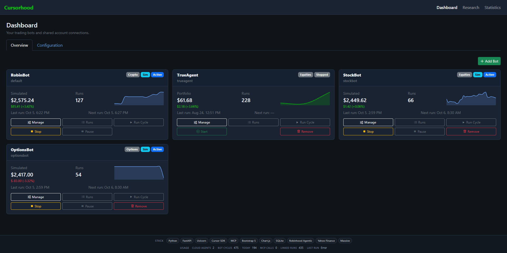

# Cursorhood Agentic Trading Console



**Cursorhood Agentic Trading Console** is a local web console for [Robinhood Agentic Trading](https://robinhood.com/us/en/agentic-trading). It runs [Cursor](https://cursor.com) agents against the official Robinhood MCP server at `https://agent.robinhood.com/mcp/trading`, with a dashboard, risk limits, paper trading, and optional extra market data.

Cursor’s multi-agent setup is the point: you can run several bots at once and give each the model that matches how you want it to trade — a fast Composer cycle for dip-buys, a heavier Claude or GPT model for options or research, Auto when you want included plan usage. One key, many specialists.

You keep the process on your machine. The agents trade only in your **Agentic account** (separate from your main Robinhood portfolio), and only after the local risk hook allows the order.

See [DEMO.md](DEMO.md) for a walkthrough of the console, and [CHANGELOG.md](CHANGELOG.md) for release history.

## What you can do

- Run **multiple strategy bots** side by side, each with its own markdown strategy, risk limits, schedule, and **Cursor model** — pick the model that fits that bot’s pace and asset class.
- Start in **simulation mode** — paper fills against a multi-asset ledger (equities, options, crypto) with FIFO realized P&L, resting limit/stop orders, and optional T+N settlement. Turn simulation off only when you are ready for live Agentic trades.
- Trade from a **static symbol list**, one of your Robinhood **watchlists**, a popular list, or a saved **scan**.
- Pick **one asset class per bot** — equities, single-leg options, or crypto. Crypto bots keep cycling 24/7 instead of sleeping at the equity close.
- Research symbols from `/research` (tape, 1H/1D candlesticks via TradingView Lightweight Charts, full fundamentals, financials, earnings, news, SEC filings, ratings, scanners, watchlists) without stuffing that into every cycle prompt.
- Watch live activity, run history, a paginated 4×4 price-history grid (or list) for each bot’s scanned tickers, portfolio sparklines, and per-bot statistics.

Trades never bypass `.cursor/hooks/check_trade.py`. Uncertain setups skip the trade.

## Requirements

- Python 3.11+
- A [Cursor API key](https://cursor.com/settings) (cycles bill as **API usage**, not IDE Auto/Composer quota)
- [Robinhood Agentic Trading](https://robinhood.com/us/en/agentic-trading) access and a **funded Agentic account**
- Optional: [Massive API key](https://massive.com/docs/rest/quickstart) if you want Massive as a last-resort fallback when Robinhood and Yahoo historicals are unavailable (free tier: 5 calls/minute)

New to Robinhood? Open an account with the referral link in [Support this project](#support-this-project) — you get a stock reward, and it helps the console stay maintained.

## Quick start

```powershell
git clone https://github.com/Thinkmonger/Cursorhood.git
cd Cursorhood
python -m venv .venv
.venv\Scripts\activate
pip install -e .

copy .env.example .env
# Set CURSOR_API_KEY in .env (optional: MASSIVE_API_KEY)

python -m runner.main
```

If `pip install` fails with SSL errors on Windows:

```powershell
pip install --trusted-host pypi.org --trusted-host files.pythonhosted.org -e .
```

Open **http://127.0.0.1:8765/** in your browser. Stop the server with **Ctrl+C** in that terminal.

| URL | Purpose |
|-----|---------|
| `/` | Dashboard — bots, capability chips, start/pause/stop |
| `/?tab=config` | Shared connections — Cursor, Massive, Robinhood OAuth |
| `/bots/{id}` | Bot console — portfolio, scheduler, risk, paper trading |
| `/bots/{id}/agents` | Run history and live activity |
| `/research` | Symbol search, reports, scanners, watchlists |
| `/research/watchlists/{id}` | Watchlist overview — 4×4 daily mini-charts |
| `/statistics` | Overview KPIs, system usage, and per-bot status |

Legacy paths (`/setup`, `/settings`, `/agents`) redirect to the routes above.

### First-run checklist

1. **Cursor key** — paste it on **Configuration**, or put `CURSOR_API_KEY` in `.env`.
2. **Connect Robinhood** — **Configuration → Connect Robinhood** (desktop OAuth). If that fails, connect the MCP in Cursor (`Settings → Tools & MCPs → https://agent.robinhood.com/mcp/trading`) and enable **Use Cursor MCP**.
3. **Confirm tools** — **Test Robinhood** should report the live catalog (currently 79 tools). Capability chips on the dashboard show which asset classes your account can reach.
4. **Leave simulation on** until you trust the strategy. Default bots start in paper mode with `$500` simulated cash.
5. Write a short **strategy.md** on the bot page, choose **equities / options / crypto**, set **allowed symbols** (or a watchlist source), then **Start** the scheduler or run one cycle:

```powershell
python -m runner.main run-once
python -m runner.main run-once --bot trueagent
```

On Windows, the process keeps the PC from sleeping so scheduled cycles can fire. The monitor and screensaver may still turn off. Stopping the process restores normal power settings.

## Security

The console has no login: it trusts whoever can reach the port. Bind to loopback (the default) and treat the machine as the trust boundary.

- **Origin pinning** rejects cross-site `POST`s that would start, pause, or reset a bot (CSRF).
- **Host pinning** rejects DNS-rebinding `Host` headers so a hijacked hostname cannot read settings.
- Responses include `X-Content-Type-Options`, `X-Frame-Options`, `Referrer-Policy`, and `Permissions-Policy`. HTML stays `no-cache`; `/static` and `/locales` cache for a day (assets are already cache-busted with `?v=`).
- Settings APIs return masked keys (`cursor_api_key_masked`), never the raw secret. Cursor and Massive keys are stored in the OS keyring (service `robinhood-agentic-bot`); process env still wins for CI. Keys are not written to SQLite.
- WebSocket `/ws` accepts only the same origin set as HTTP writes.

To expose the dashboard beyond loopback, set `DASHBOARD_ALLOWED_HOSTS` and `DASHBOARD_ALLOWED_ORIGINS`. Do not put this process on the public internet.

## How a cycle works

Each scheduled run:

1. Resolves the bot’s symbol universe (static list, watchlist, popular list, or scan).
2. Prefetches portfolio, holdings, quotes, technicals, and (when enabled) option/crypto positions.
3. Builds a bounded **Context** JSON — size depends on the bot’s `context_profile` (`minimal` by default).
4. Starts a Cursor agent with only the MCP tool categories that bot needs.
5. The agent may review then place an order, or skip. Every order hits the risk hook first.
6. In simulation, the paper broker fills or rests the order; nothing is sent to Robinhood. In live mode, the order goes to your Agentic account.
7. The agent must `log_event` so the dashboard and statistics stay in sync.

If the market is closed and `market_hours_only` is on, equity and options bots sleep until the next open. Crypto bots keep cycling.

## Connections

Configure shared credentials on **Configuration** (`/?tab=config`):

| Connection | Purpose |
|------------|---------|
| **Cursor API key** | Powers agent cycles via the Cursor SDK |
| **Massive API key** | Optional last-resort fallback for bars after Robinhood and Yahoo |
| **Robinhood** | OAuth to your Agentic account |

### Cursor models (multi-agent)

Each bot is its own Cursor agent. That is how you mix styles without forcing one model onto every strategy:

| Fit | Typical choice | Why |
|-----|----------------|-----|
| Frequent equity or crypto cycles | **Composer** (`composer-2.5`) or **Auto** | Fast, cheap enough to run every few minutes; draws included Cursor/IDE usage |
| Options, research-heavy prompts, or “read more before you trade” | **Claude, GPT, Gemini**, or another API model | Stronger reasoning on chains, news, and messy context; billed at the provider rate |
| A second opinion | A different model on a second bot | Same watchlist, different brain — compare fills in simulation before you go live |

The bot **Cursor model** dropdown lists every model your key can use, grouped into **IDE / Cursor models** (Auto, Composer, Cursor Grok) and **API (third-party)**. Change it per bot on **Configuration**; `GET /api/settings/cursor/models` returns the same catalog. Default is **`composer-2.5`**.

Cycles use the **Cursor SDK with your API key**. Most third-party models bill **API usage** (SDK tag) on your Cursor dashboard. Auto, Composer, and Cursor Grok use included plan usage.

- The SDK runs **locally** with explicit `local` runtime, inline MCP config, and no IDE project settings.
- Each cycle uses `Agent.create` + `agent.send` with streaming and proper SDK disposal on shutdown.
- `agent_id` and `cursor_run_id` show up in the activity timeline for debugging in the Cursor console.

### Market data

Bars and indicators resolve **Robinhood first** (`get_equity_historicals` + `get_equity_technical_indicators`), then **Yahoo**, then **Massive** if a key is set and both earlier sources failed. Each symbol’s entry carries a `provider` field so you can see the source. Native Robinhood indicators replace the locally computed SMA-20 when they are present; local math stays as the fallback.

Bots emit only the indicators their strategy text mentions (RSI, MACD, Bollinger, ATR, VWAP, EMA, SMA-50/200). Unused indicators cost nothing.

You can set a Massive key in `.env` or from the console (**Save Massive Key** / **Test Massive**). With `MASSIVE_USE_SMA_ENDPOINT=true` (default), each Massive call returns hourly bars **and** SMA-20 via the [SMA indicator API](https://massive.com/docs/rest/stocks/technical-indicators/simple-moving-average).

### Environment variables

Copy `.env.example` to `.env`. Keys can also be saved from the Configuration tab.

| Variable | Default | Description |
|----------|---------|-------------|
| `CURSOR_API_KEY` | — | Cursor agent API key (required) |
| `MASSIVE_API_KEY` | — | Massive REST API key (optional last-resort after Robinhood and Yahoo) |
| `MASSIVE_API_BASE_URL` | `https://api.massive.com` | Massive API base URL |
| `MASSIVE_RATE_LIMIT_PER_MINUTE` | `5` | Client-side rate limit |
| `MASSIVE_RETRY_WAIT_SECONDS` | `65` | Max wait when retrying Massive after Yahoo failure |
| `MASSIVE_USE_SMA_ENDPOINT` | `true` | Bars + SMA-20 in one Massive call per symbol |
| `DASHBOARD_HOST` | `127.0.0.1` | Web console bind address |
| `DASHBOARD_PORT` | `8765` | Web console port |
| `OAUTH_CALLBACK_PORT` | `9876` | Robinhood OAuth callback port |
| `SSL_VERIFY` | `true` | Set to `false` on Windows if Robinhood MCP HTTPS fails with certificate errors |

```env
CURSOR_API_KEY=your_cursor_key
MASSIVE_API_KEY=your_massive_key
SSL_VERIFY=false
```

On some Windows setups, Python cannot verify Robinhood’s TLS certificate chain; `SSL_VERIFY=false` is required for MCP calls to succeed. The app logs that warning **once per process**, not on every request.

## Bots, risk, and paper trading

Each bot has its own strategy, limits, and scheduler. Creating a bot picks **Equities**, **Options**, or **Crypto** and seeds a class-specific playbook from `config/templates/`. Runtime copies live in SQLite (`bot_settings`); the YAML files are seed templates and a one-time import for existing bots. Edit strategy and limits from the bot’s **Configuration** tab.

| Path | Purpose |
|------|---------|
| `config/templates/{equity,option,crypto}/` | Class seed strategy, limits, and app settings |
| `config/strategy.md` | Default bot seed (imported into SQLite on first read) |
| `config/limits.yaml` | Default bot seed limits |
| `config/app.yaml` | Default bot seed scheduler and simulation settings |
| `config/global.yaml` | Shared dashboard host/port (optional; created on save) |
| `config/bots/{id}/` | Example / leftover YAML (imported once if no SQL row) |
| `data/bot.db` | Bots, `bot_settings`, runs, events, paper ledger |
| `.env` | Optional API-key fallback; UI saves go to the OS keyring |
| `AGENTS.md` | Agent playbook (reference; cycle prompts use Context JSON) |

Useful limits (see the bot page for the full form):

- **Symbol source** — `static`, `watchlist`, `popular_watchlist`, or `scan`, capped by `symbol_source_limit` (default 20). Empty resolution falls back to the static allowlist rather than trading blind.
- **Equity caps** — `max_order_notional_usd`, `max_open_positions`, `max_daily_loss_usd`, `market_hours_only`, `min_seconds_between_orders`.
- **Asset class** — `equity` (default), `option`, or `crypto`. A bot cannot mix them; the other class's tools are hidden and the risk hook denies mismatched orders.
- **Options** — contract count, option notional (premium × 100 × qty), days-to-expiry window, call/put allowlist. Selling is blocked unless `allow_option_selling` is on. The hook also denies `exercise_option` — close the contract instead.
- **Crypto** — optional pair allowlist (empty = use the symbol source) and notional cap; exempt from the equity market-hours gate.
- **Context profile** — `minimal` (default), `standard`, or `research`. Research context is opt-in so token cost stays low.

Paper trading is a real broker, not a log of pretend fills: market/limit/stop/stop-limit orders, resting orders re-checked each cycle, cancels, FIFO lots, realized P&L, optional slippage/commission, and T+N settlement. Existing ledgers migrate once to the new schema. Run `python scripts/sim_regression.py` to exercise the engine without touching a live bot.

**Context profile vs tools.** Account, watchlist, and alert tools are always exposed. Market-data and equity tools go to equities and options bots. Crypto tools go only to crypto bots. Scanner tools appear when enabled.

| Bot configuration | Tools exposed | Schema tokens saved per cycle |
|---|---|---|
| Equities only | 53 / 79 | ~2,900 (33%) |
| Equities + scanners | 59 / 79 | ~2,250 (25%) |
| Options | 65 / 79 | ~1,575 (18%) |
| Crypto | ~31 / 79 | — |

`GET /api/trading/capabilities` returns the live catalog grouped by category.

## Robinhood MCP tools

The proxy forwards Robinhood’s live `tools/list` and merges it with a categorized baseline in `src/trading/mcp_tools.py`. Unknown tools Robinhood ships later still register; a name heuristic classifies them for the activity timeline and the risk hook.

The live catalog is **79 tools** across 8 categories (verified against an Agentic account, not only the [support article](https://robinhood.com/us/en/support/articles/trading-with-your-agent/)):

| Category | Count | Tools |
|----------|-------|-------|
| Account | 5 | `get_accounts`, `get_portfolio`, `get_realized_pnl`, `get_pnl_trade_history`, `search` |
| Watchlists | 12 | `get_watchlists`, `get_watchlist_items`, `get_option_watchlist`, `get_popular_watchlists`, `create_watchlist`, `update_watchlist`, `follow_watchlist`, `unfollow_watchlist`, `add_to_watchlist`, `remove_from_watchlist`, `add_option_to_watchlist`, `remove_option_from_watchlist` |
| Market data | 17 | `get_equity_historicals`, `get_equity_fundamentals`, `get_financials`, `get_equity_price_book`, `get_equity_technical_indicators`, `get_earnings_results`, `get_earnings_calendar`, `get_indexes`, `get_index_quotes`, `get_index_historicals`, `get_equity_news`, `get_equity_analyst_ratings`, `get_politician_trades`, `get_sec_filing`, `get_sec_filing_index`, `get_sec_filing_facts`, `get_sec_filing_facts_catalog` |
| Equities | 13 | `get_equity_positions`, `get_equity_tax_lots`, `get_equity_quotes`, `get_equity_orders`, `get_equity_tradability`, `review_equity_order`, `place_equity_order`, `cancel_equity_order`, `get_advanced_orders`, `review_advanced_order`, `place_advanced_order`, `cancel_advanced_order`, `get_limited_margin_upgrade_info` |
| Options | 12 | `get_option_level_upgrade_info`, `get_option_historicals`, `get_option_chains`, `get_option_instruments`, `get_option_quotes`, `get_option_positions`, `get_option_orders`, `review_option_order`, `place_option_order`, `cancel_option_order`, `exercise_option`, `cancel_option_exercise` |
| Crypto | 8 | `get_currency_pairs`, `get_crypto_quotes`, `get_crypto_positions`, `get_crypto_orders`, `preview_crypto_order`, `place_crypto_order`, `cancel_crypto_order`, `get_crypto_account_onboarding_info` |
| Scanners | 6 | `get_scans`, `get_scanner_filter_specs`, `create_scan`, `run_scan`, `update_scan_filters`, `update_scan_config` |
| Alerts | 6 | `get_alerts`, `create_alert`, `update_alert`, `delete_alert`, `get_alert_log`, `mark_alerts_read` |

Agents should **review before placing**: `review_equity_order`, `review_option_order`, `preview_crypto_order`.

## Internationalization

UI copy lives in `locales/en.json`. The web app loads strings via `web/static/i18n.js` (`data-i18n` attributes in HTML, `t()` in JavaScript). Add `locales/{locale}.json` and extend `initI18n()` to support additional languages.

## Project layout

```
runner/              Entry point, scheduler, cycle prompts
src/api/             FastAPI routes and WebSocket
src/trading/         MCP registry, market data, watchlists, options, crypto, research
src/simulation/      Paper broker (engine, positions, fills, accounting)
src/system/          Sleep prevention, server restart helpers
src/i18n/            Server-side locale helpers
web/                 Dashboard, research page, static assets
locales/             UI copy (English default)
config/              Default YAML strategy and limits
scripts/             Paper-broker regression
.cursor/hooks/       Trade risk enforcement
CHANGELOG.md         Release history
AGENTS.md            Agent playbook for automated cycles
```

## Support this project

The source in this repository stays free under the MIT license, including the `v0.2.0` tag. A packaged Windows build is sold separately for **$79** once. That paid line is developed in private, already contains Python and the Cursor bridge, and is not published on this branch. The purchase link is a Stripe Payment Link created from the seller’s Stripe account. Venmo below is a tip, not the purchase.

Two easy ways to support the free console:

**Open a Robinhood account with this referral.** New users who sign up at [join.robinhood.com/laurenw275](https://join.robinhood.com/laurenw275) can claim a **$5–$200 stock reward** (you are guaranteed at least $5 after linking a bank; 1 in 100 get $20, and 1 in 1,000 get $200 — [terms apply](https://join.robinhood.com/laurenw275)). You pick from a set of leading companies. For the signup to count as a referral you need to add money to the account. That also funds the Agentic account this console trades in.

**Send a tip on Venmo.** If the console saved you time or you just like it, Venmo [Lee Whitworth](https://venmo.com/code?user_id=3116446615863296136&created=1789922505) (`@LeeWhitworth`). Completely optional.

Neither is required to run the software.

## License

This project is released under the [MIT License](LICENSE).

## Disclosures

You are responsible for all trades. Agentic trading involves significant risk of loss, including the entire balance of the Agentic account. This software is not affiliated with, endorsed by, or a product of Robinhood. Brokerage services through Robinhood Financial LLC (member SIPC). Referral rewards are offered by Robinhood, not by this project; see Robinhood’s terms on the signup page. Tips via Venmo are voluntary and do not purchase support, trading advice, or any security.
